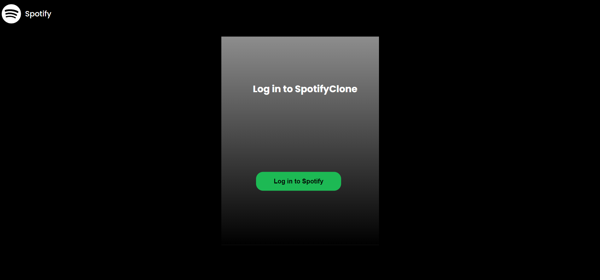
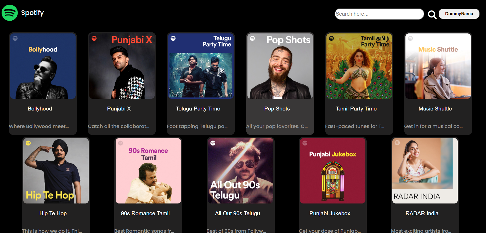
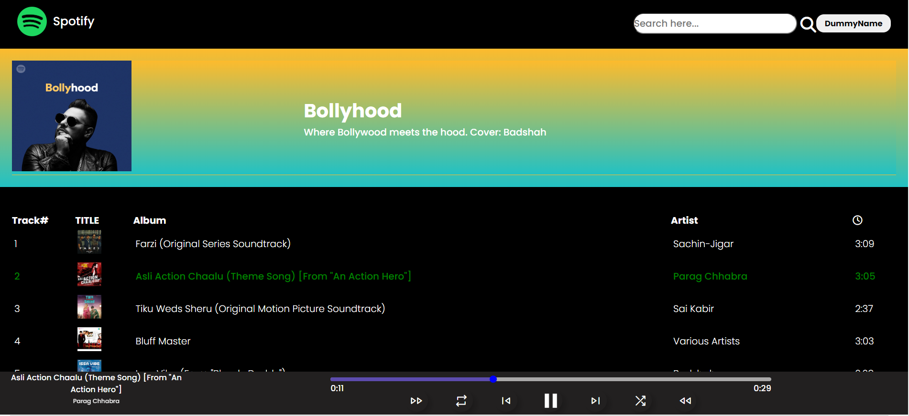
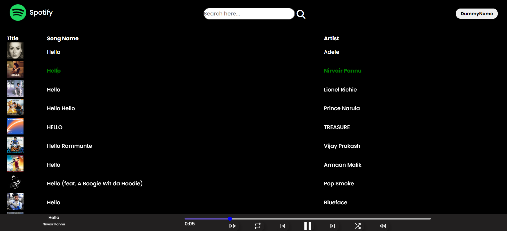

**Spotify Clone**

A Spotify clone built using HTML, CSS, and JavaScript that allows users to log in, view featured playlists, play songs, search for tracks, and control the playback.

**Hosted Link:**
https://6476dabb481a915c8e9f1c21-prismatic-c.netlify.app/ 

# Login to your Spotify account using the below credentials to access this application
Email: spotifydummyclone@gmail.com
Password: SpotifyClone@100

**_Note: Access Limitations_**

Please be aware that this Spotify clone project uses admin API access for authentication and fetching featured playlists. As a result, users logging in with their personal Spotify accounts won't be able to view their own playlists.

# Features
•	User authentication with Spotify credentials

•	View and play featured playlists

•	Browse and play songs from the selected playlist

•	Control playback (play/pause, next, previous)

•	Repeat and shuffle songs

•	Fast forward and rewind song

•	Clickable progress bar to seek to a specific position in the song

•	Search for songs, artists, etc.

# Prerequisites
•	**VS Code:** Users should have Visual Studio Code (VS Code) installed on their machines. VS Code is a lightweight, open-source code editor that provides an excellent development environment for web applications. Users can download and install VS Code from the official website: https://code.visualstudio.com/

•	**Web Browser:** To view and interact with the application, you need a modern web browser such as Google Chrome, Mozilla Firefox, or Microsoft Edge.

•	**Spotify Account:** Since this project is a Spotify clone, users need to have a Spotify account to log in and access Spotify's features. If you haven't created a Spotify account yet, you can sign up at https://www.spotify.com/ and use the credentials provided above.

# Technologies Used

**HTML:** Used for creating the overall structure and elements of the web pages.

**CSS:** Utilized for styling the user interface, including the design, layout, and responsiveness, giving the app a visually appealing look.

**JavaScript:** Employed to handle the interactivity and dynamic functionalities of the web application, such as playing songs, controlling playback, and handling user interactions.

**VS Code:** Chosen as the code editor for its powerful features and ease of development.

**GitHub:** Utilized for version control, enabling seamless collaboration with other developers and easy project management.

**Spotify Web API:** Integrated to authenticate users, access user data, and fetch Spotify's featured playlists, song details, and search results.

# Screenshots
Login Page

Home Page

Playlist Page

Search Page

 

